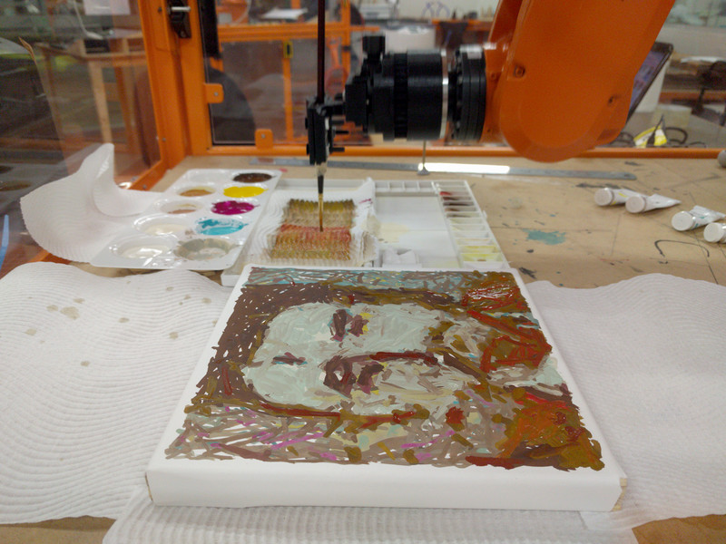
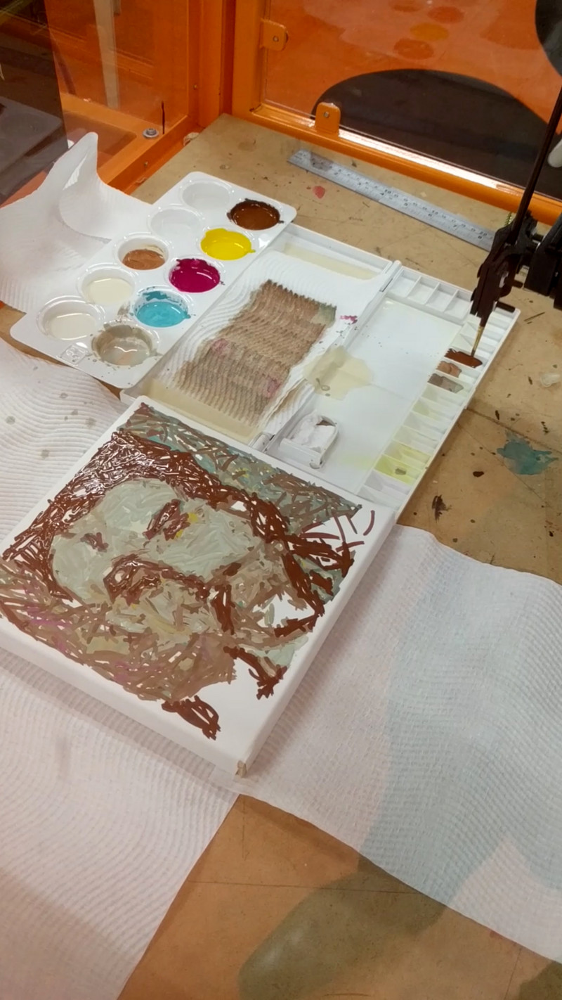
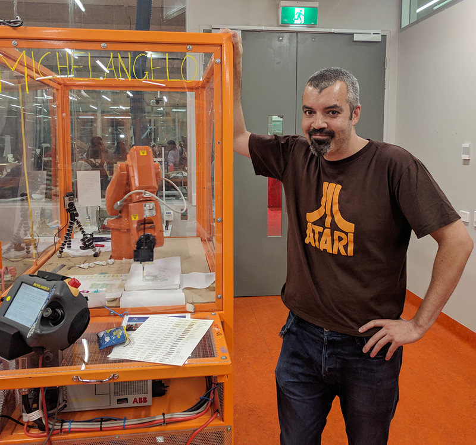

*028749_0001_08* was my first robot & AI-generated painting and received 6th
place in the 2018 Robotart.org robotic art competition. It was a technical
proof of concept for a series of paintings I am currently working on. I used
several GAN and discriminator neural networks, trained on late 1800's
expressionist portraits, to generate a source 64x64 pixel thumbnail. Hundreds
of thousands of candidate images were generated, and scored using networks
trained on personal taste parameters. The final image was then translated into
a set of paint mixing and brush stroke instructions for an ABB IRB 120
industrial robot arm. The painting is gouache on watercolor paper. It used
approximately 4,000 brush strokes and was painted in a single 3-hour session
with human intervention only to replenish the 5 primary paint colors and fix
last-minute bugs. Special thanks to Loren Adams and the team at the University
of Melbourne School of Design for their support and assistance in making this
project a reality.





