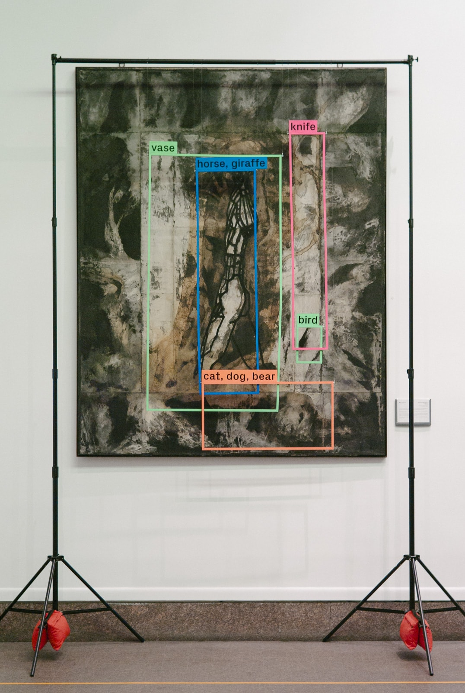
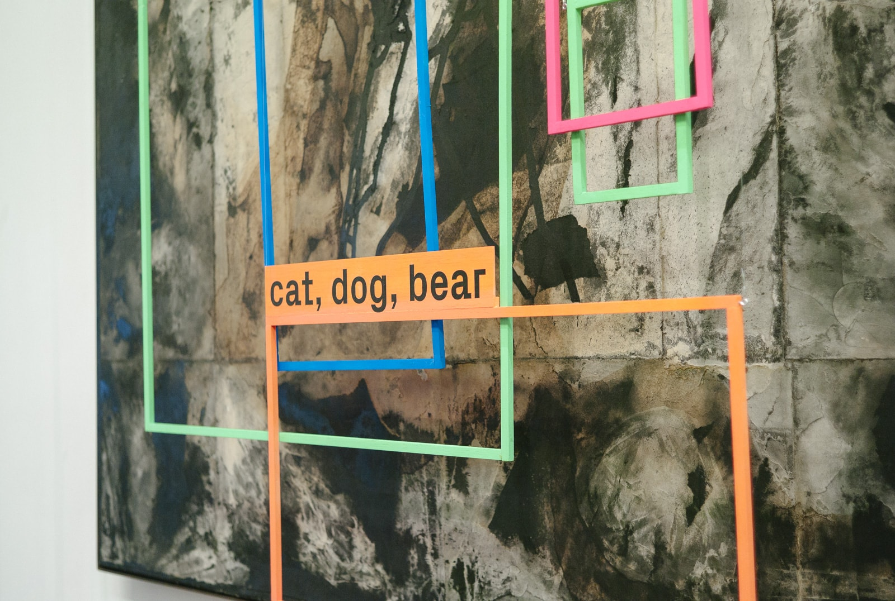
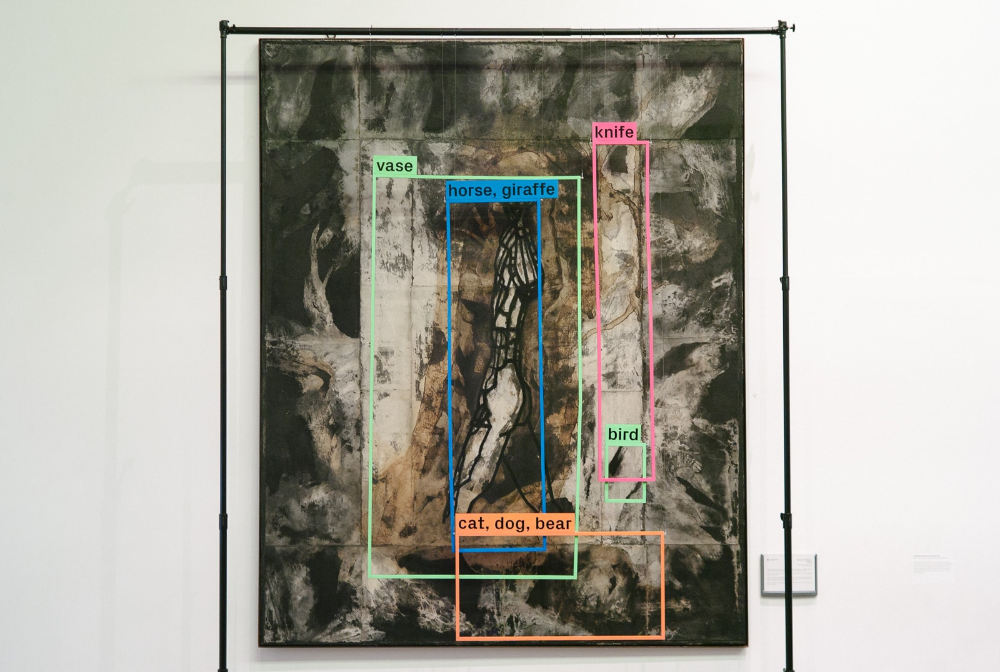
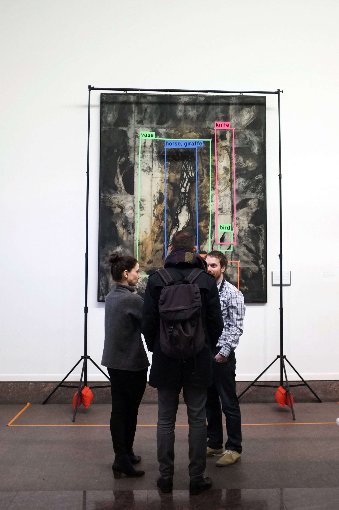

Commissioned by DAAD for the Consulate General of Germany in New York, the
installation revisits a permanent artwork in the consulate's lobby gallery.

Michael Morgner's “Schreitender” (engl. title: “Man Pacing”) was shown to a
computer vision algorithms trying to “see” features in the image. Visualizing
what the computer saw, the installation is a physical manifestation of the
computer's limited understanding of a work of art or, perhaps, the world in
general. At the same time, it invites the viewer to see the artwork
differently, to rediscover it through new ways of looking.

