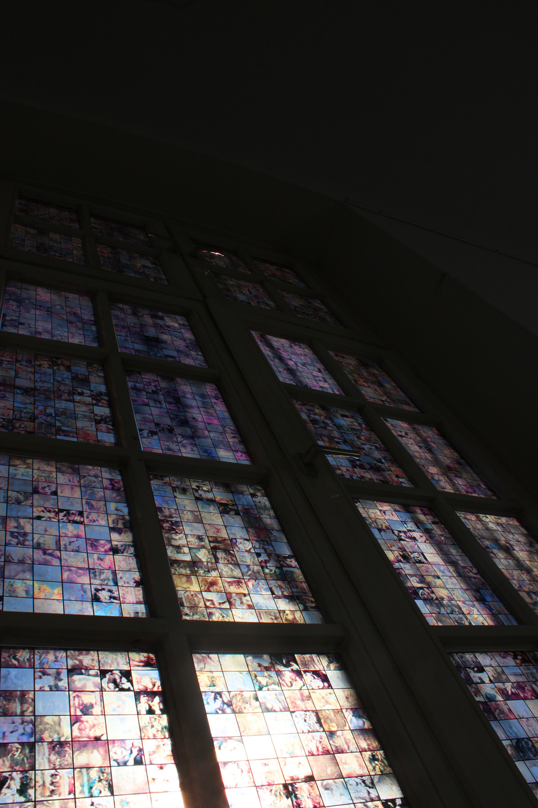
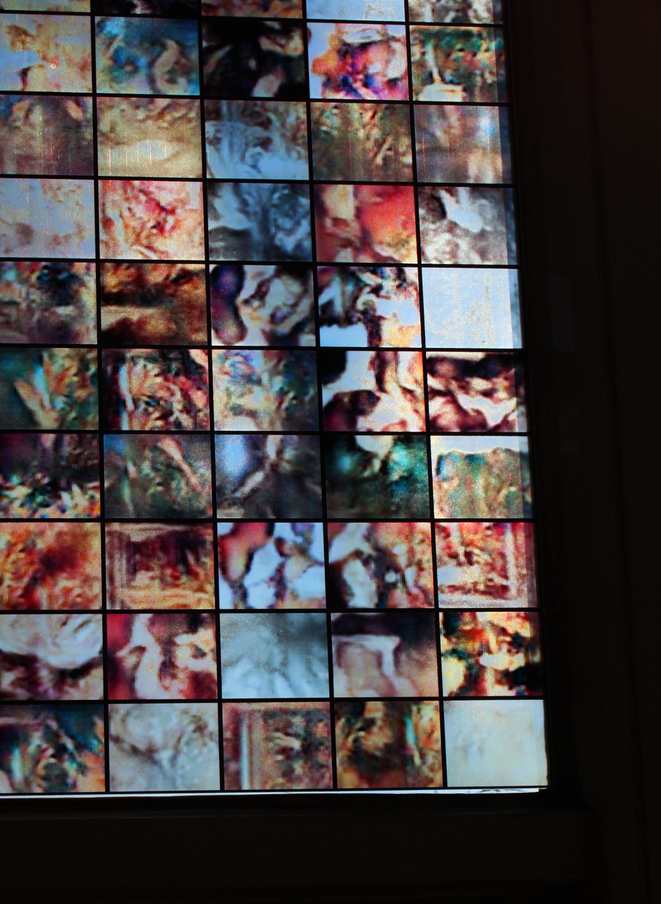
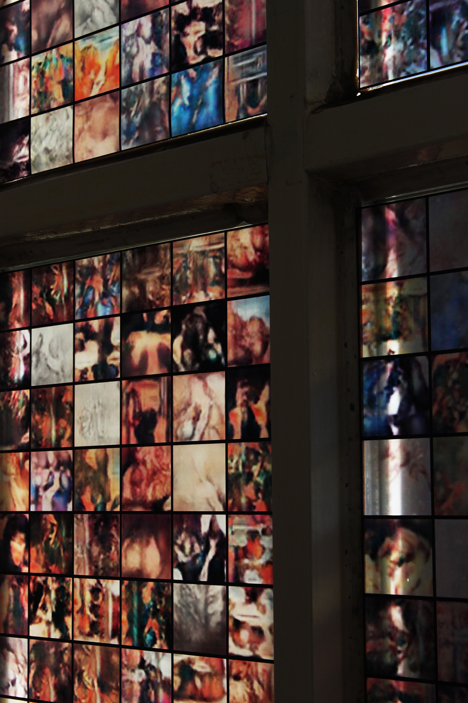
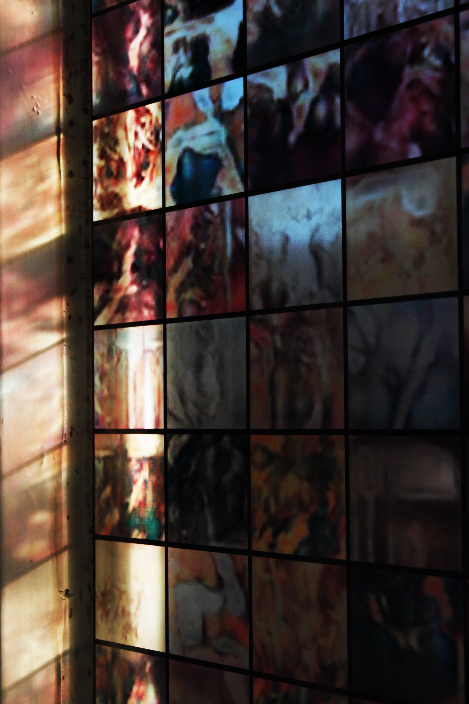
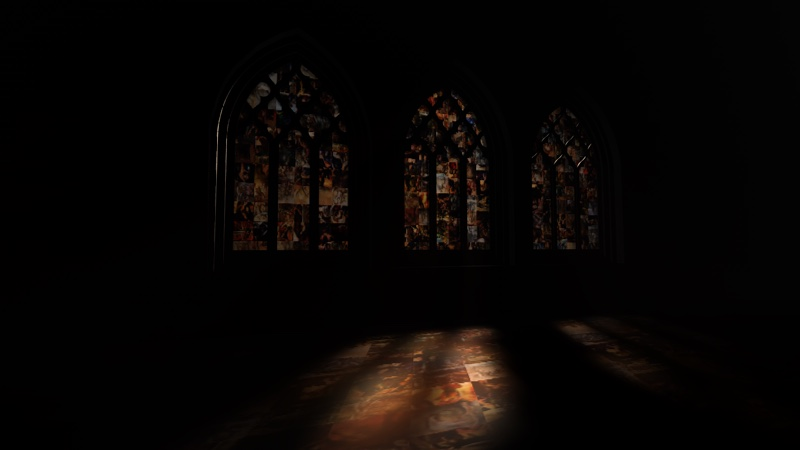
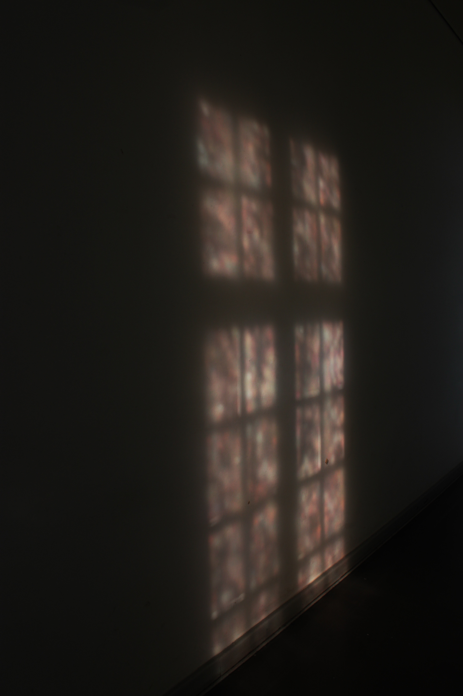

A project addressing A.I.’s potential oversimplification of human concepts that
have evolved to great complexity over time. The stained glass window depicts an
AI’s interpretation of the term Messiah.

The context of A(.I.) Messianic Window is the current trend of applying humanistic, cultural and non-universally defined concepts to artificial intelligence. Machines become intelligent by being fed with information about the world. Who is feeding them and selecting this information? What biases and perspectives are being transferred to the machines? Religion is one such nuanced concept, understanding of it differs vastly throughout the world. The term Messiah can refer to different figures or ideas depending on one’s religious belief. Pioneering A.I. research is predominantly situated in the United States, where 70% of the population identify as Christians. To highlight potential western bias resulting from this, Religion will be simplified to mean Christianity, therefore, the term Messiah will be represented by Jesus Christ.

I used artistic impressions of Jesus Christ – circa 15,000 images tagged with “Christ” from Wikigallery – to train a [DCGAN](https://github.com/soumith/dcgan.torch) over 300 epochs. In the images that were subsequently generated, I obtained an Artificial Intelligence’ interpretation of the term Messiah. These generated images are then placed back into a sacral and didactic presentation format – a stained glass window.

Humans throughout history have learnt from images, from visual data. 

AI systems are learning from visual data.  

AI systems are generating visual content. 

Humans learn from the resulting visual content, the resulting images. 

In our post photoshop society, the informative power and authority of images is still of relevance. 

CV and machine learning are therefore processes that have the power to inform people in society. 

A(.I.) Messianic Window explores the the didactic power of these images.

A(.I.) Messianic Window has been shown at Ars Electronica and NIPS.

With thanks to 

Andreas Schmelas

Andi Rueckel



