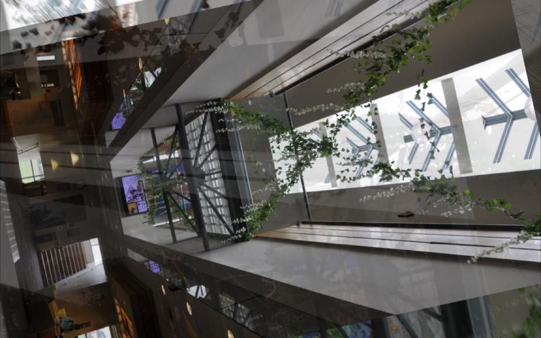
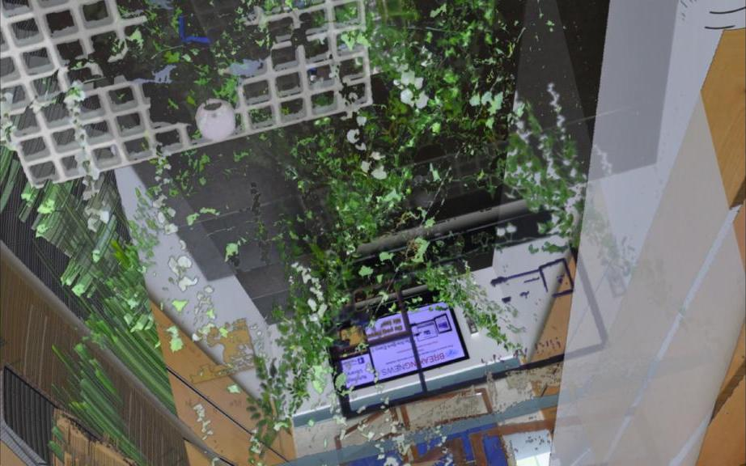
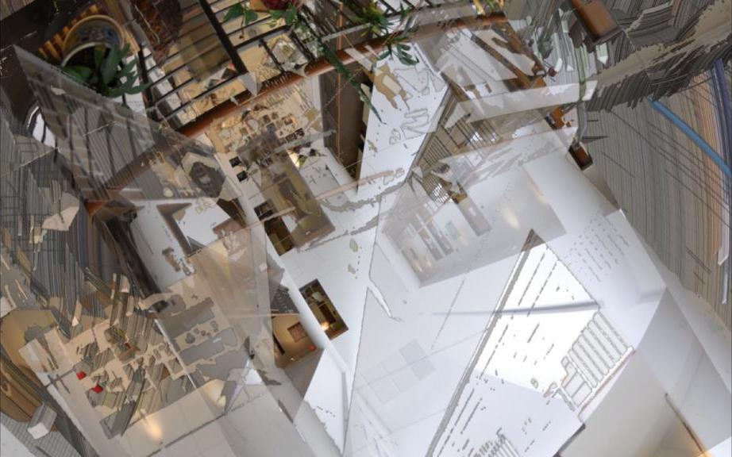
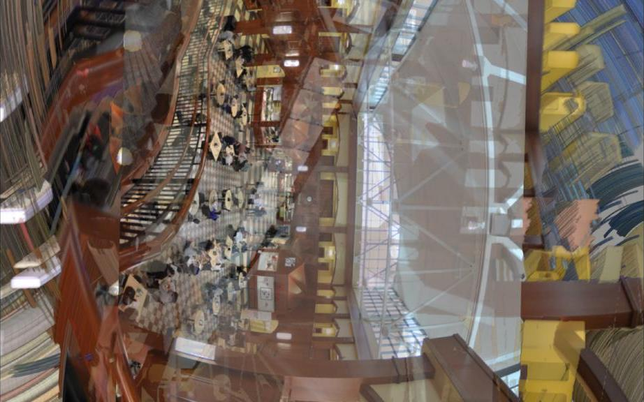
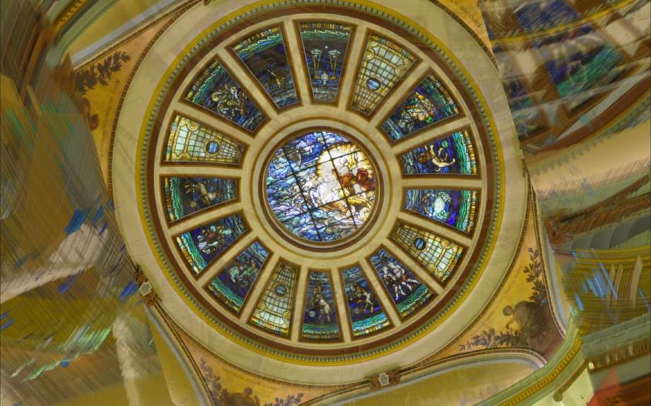

This video piece is inspired by the perceptual mechanisms of the human visual
system, which extracts & analyzes color, spatial, edge, & symbol aspects
separately, then integrates them into a composite, perceived image. Software
fragments each still image into overlays based on dominant colors, then uses
them as fading curtains that rotate & reveal the underlying, composite,
original image. Contrasting-color vegetation images and contrasting-geometry
architectural images work especially well with this technique.

