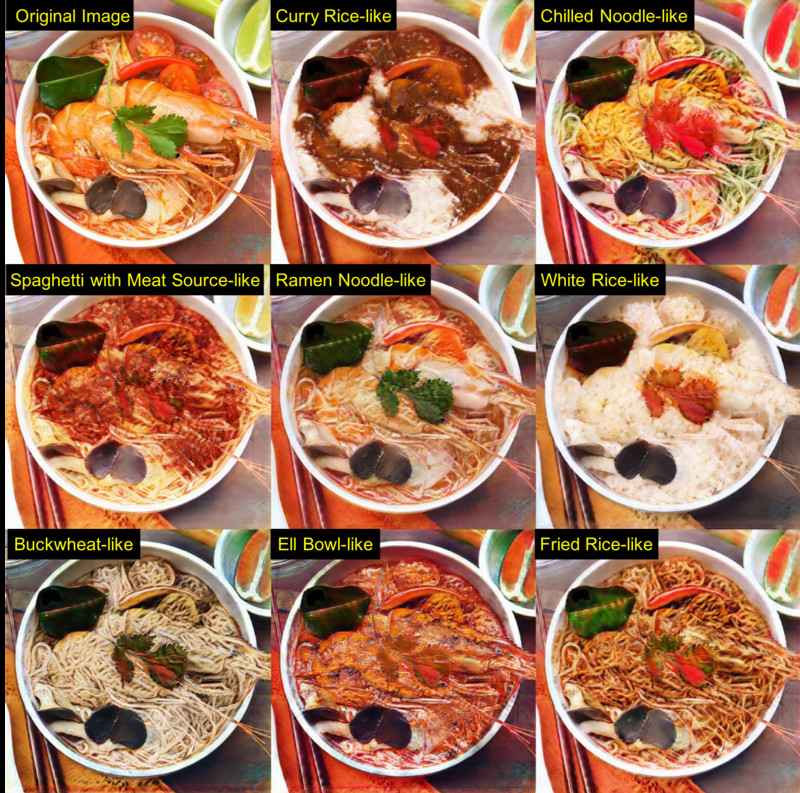
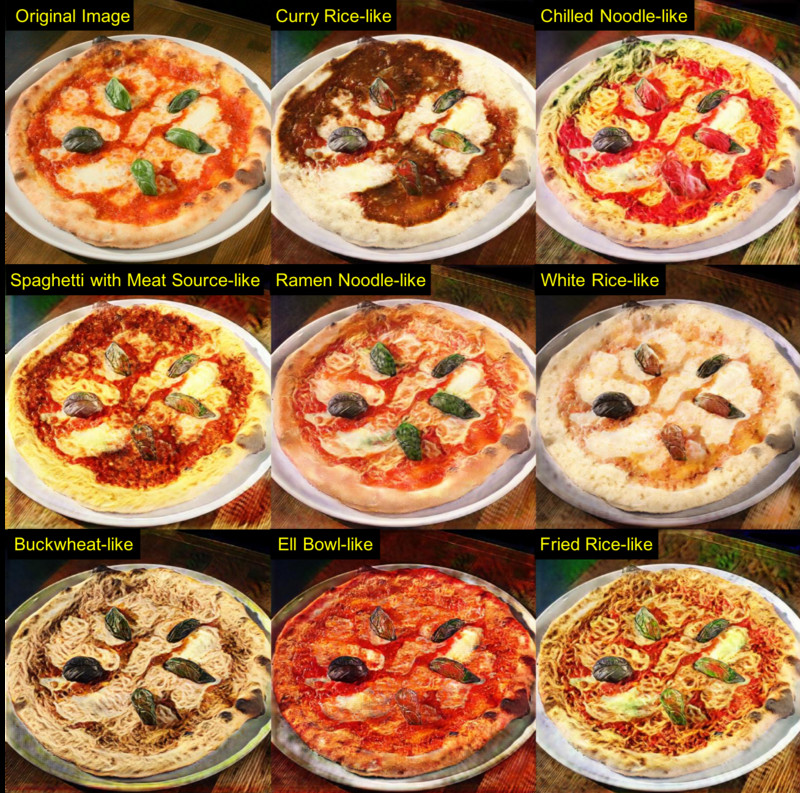
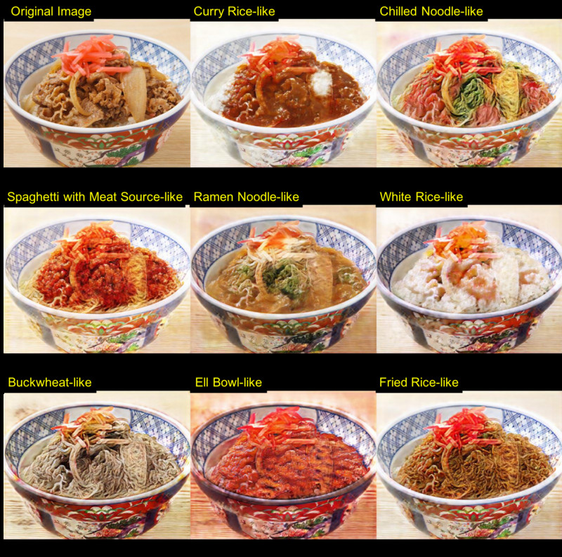
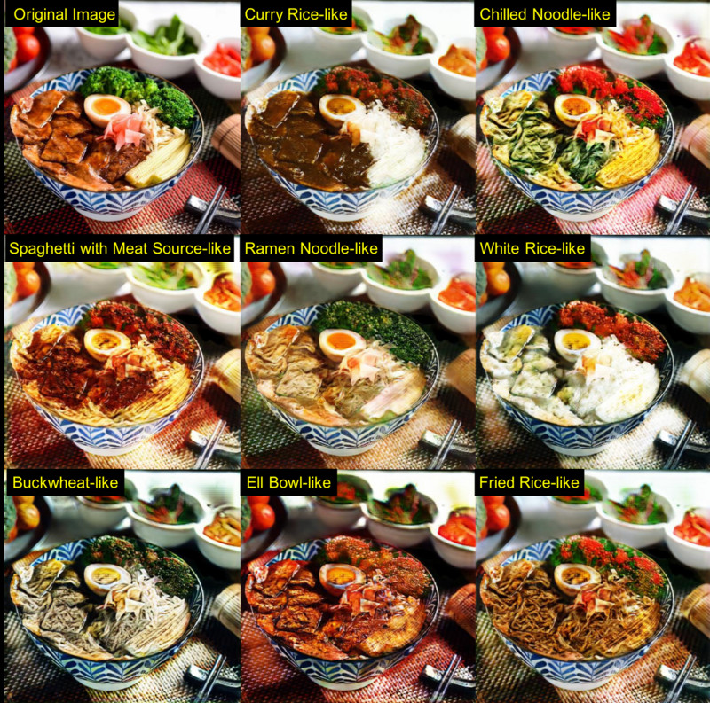
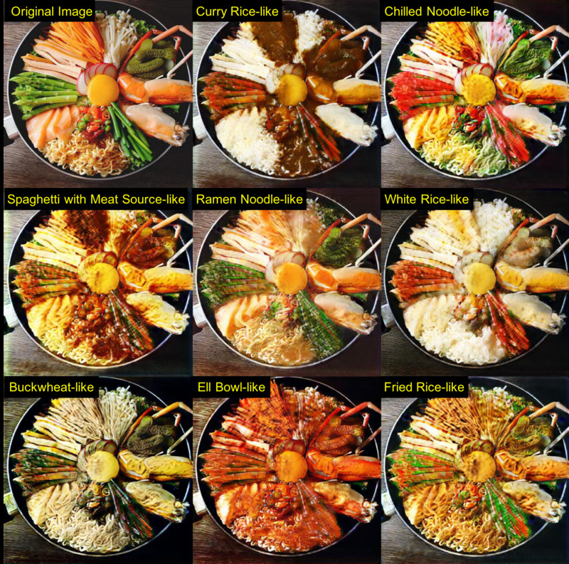
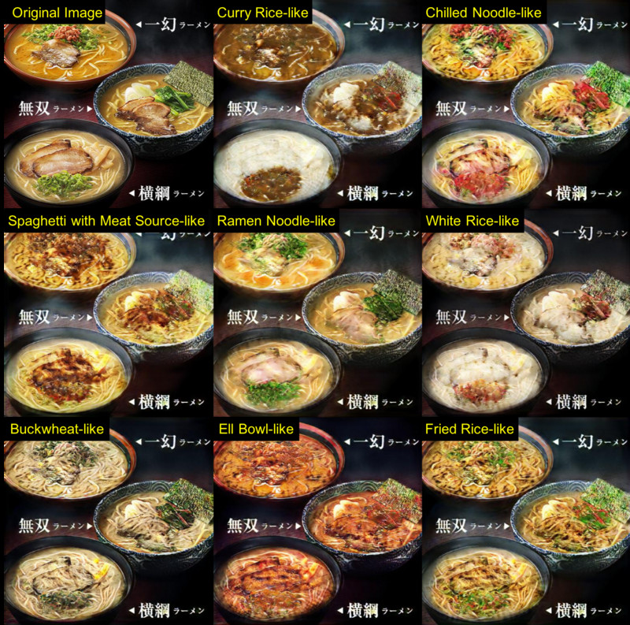

This art work describes *Food Image Transformation* based on a Conditional
CycleGAN (cCycleGAN) with a large-scale food image data collected from the
Twitter Stream. Conditional CycleGAN is an extension of CycleGAN, which enables
“Food Category Transfer” among ten kinds of foods mutually keeping the shape of
a given food. By the experiments, we show that two hundred and thirty thousand
food images with cCycleGAN enables very natural food category transfer among
ten kinds of typical Japanese foods: ramen noodle, curry rice, fried rice, beef
rice bowl, chilled noodle, spaghetti with meat source, white rice, eel bowl,
and fried noodle



