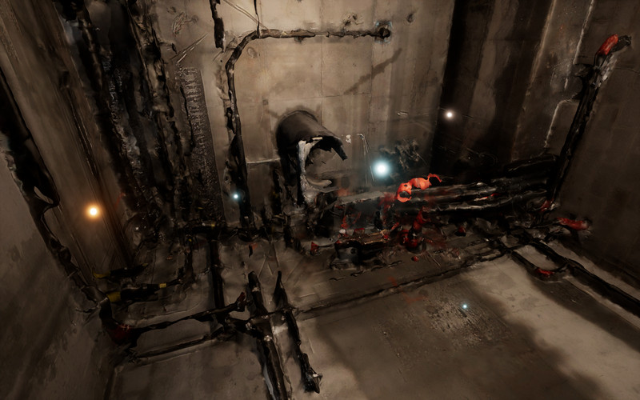
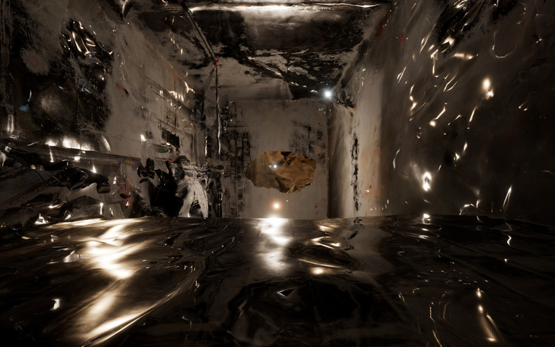
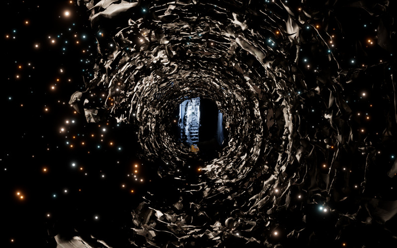
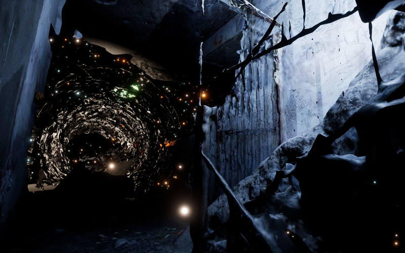
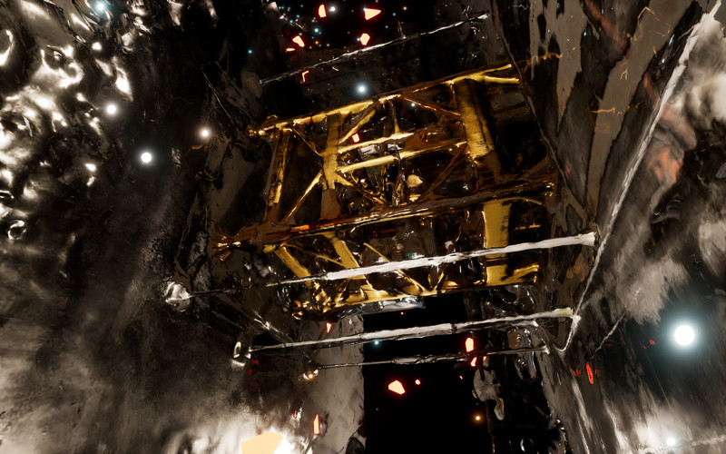
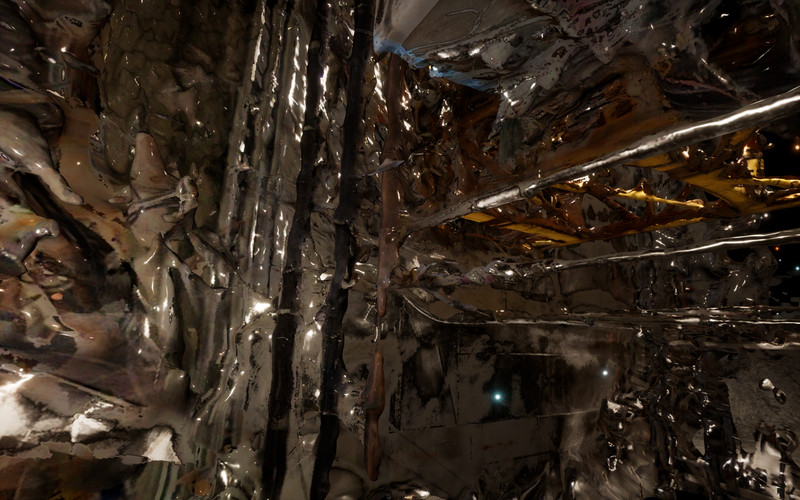
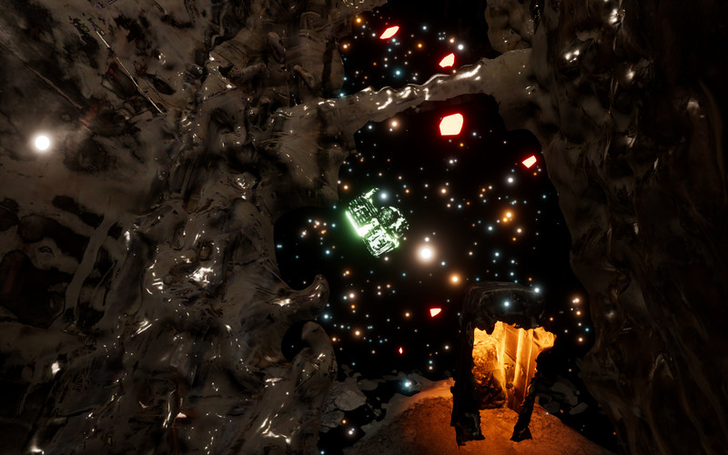
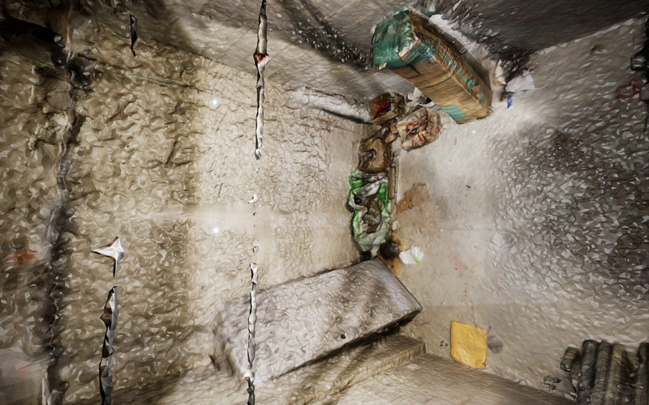
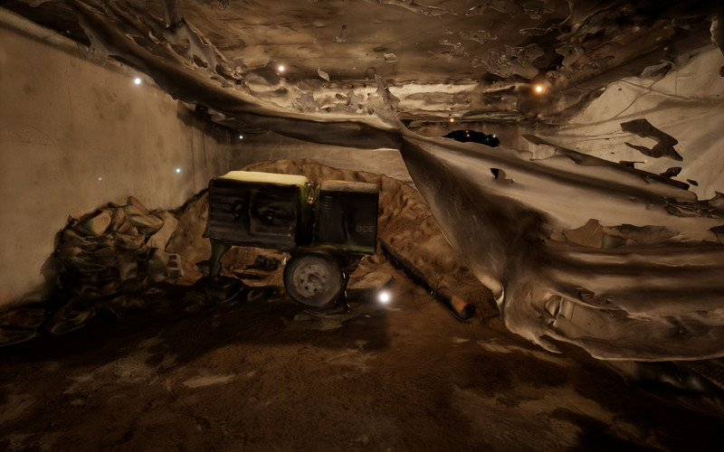

*Liquefied Realities* is a huge virtual environment made out of a number of
digital reconstructions of real-world locations in and around Toronto. At the
moment of capture, these locations were all in the process of being either
demolished or rapidly developed. I visited these in-between spaces and captured
them using a process called photogrammetry, which converts hundreds of still
images into 3D models. Most virtual environments aim for hyper-realism. These
environments are mathematically composed and rigidly optimized for good
performance: straight lines, well-delineated surfaces and “realistic” lighting
abound. Suffice to say, our experience of the real world is vastly messier,
more irregular and sketchier than these seemingly perfect spaces. In *Liquefied
Realities* I drew a tenuous connection between human depth perception and the
computer vision algorithms responsible for reconstructing depth from my
photographs. Essentially, I relinquished creative agency to my algorithmic
companions who helped me “see” these spaces and work towards a virtual
environment that is potentially more connected to our embodied experience of
reality.




