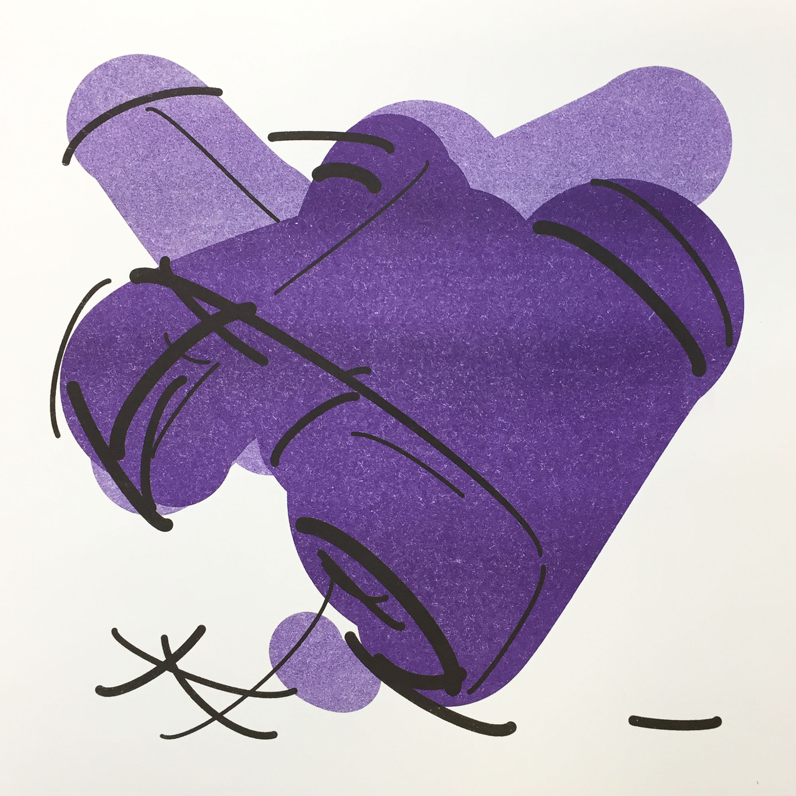
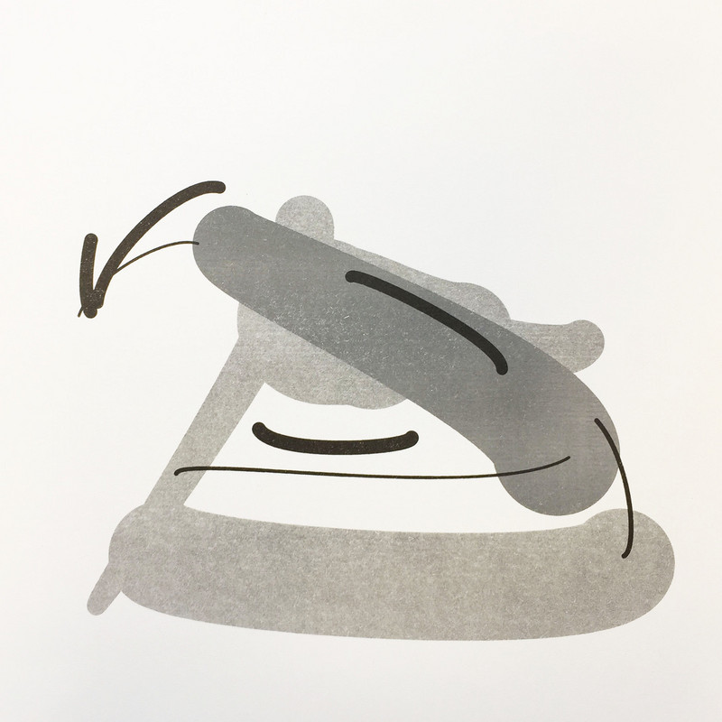
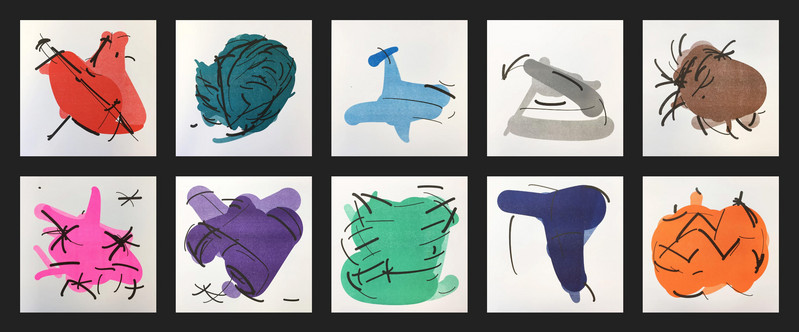

Ink prints carefully constructed so that most current and future neural network models believe they are looking at specific objects like starfish or binoculars. Though computer vision algorithms are constructed differently that human vision, our ability to also recognise these abstract forms hints that we might have more in common with our algorithms than expected.

