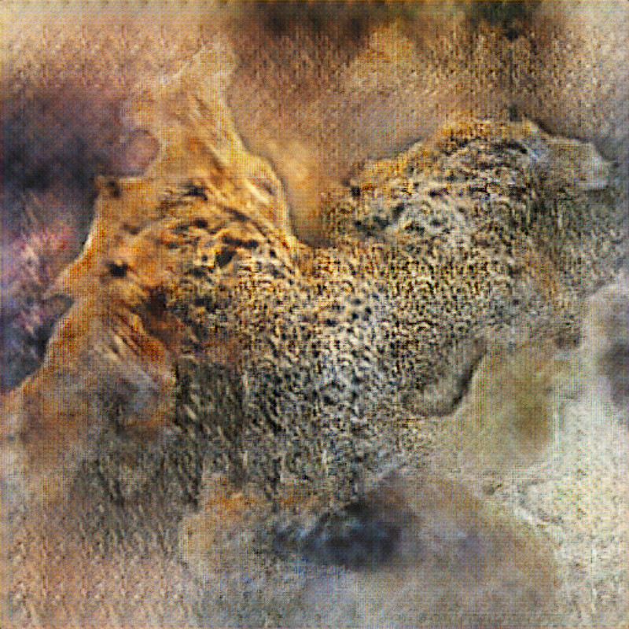
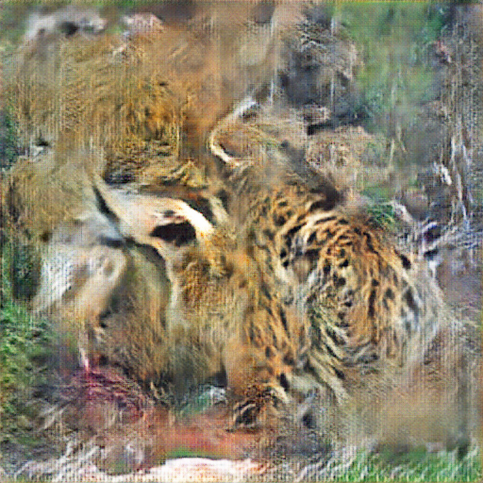
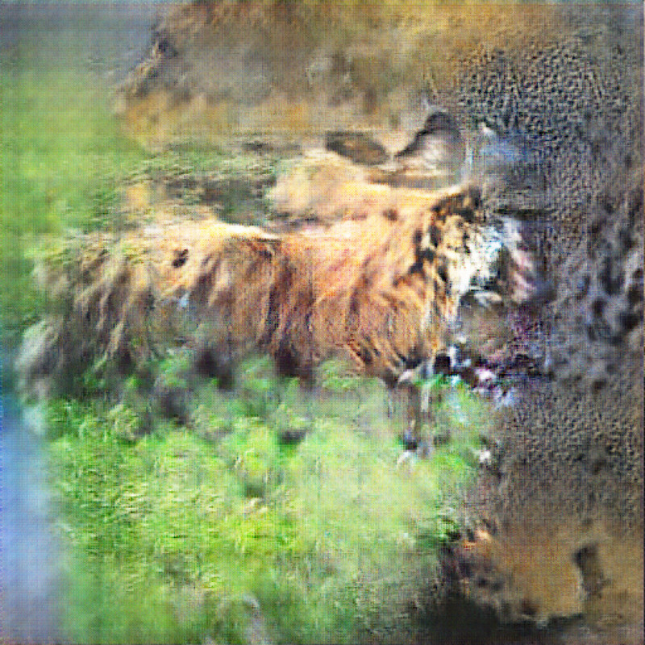
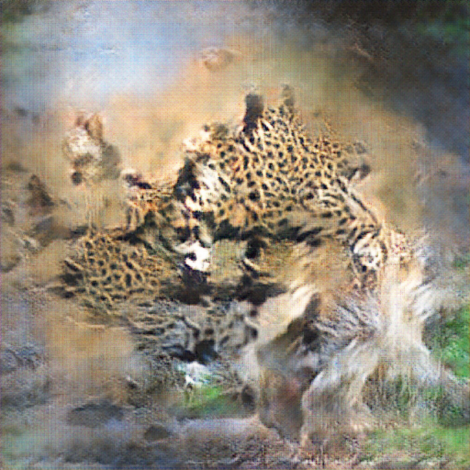

Two synthetic mind arranged in a generative adversarial network (GAN) play a game with almost three-thousand images of predatory animals in order to find what patterns emerge. Taking a walk in the so-called lateral space of the resulting neural network, the hazy visage of a jaguar appears. 

But the human eye perhaps finds itself in a moment of misapprehension. The machine constructs the image and we construct another image out of what we think we are seeing. Our own capacity for false beliefs: evolutionarily, if we perceived a predator, we had to act as if it is actually there. 

Is this superstition, then? Or proof of Dennett's Criterion which states that any object is just a pattern—real in its own right.




