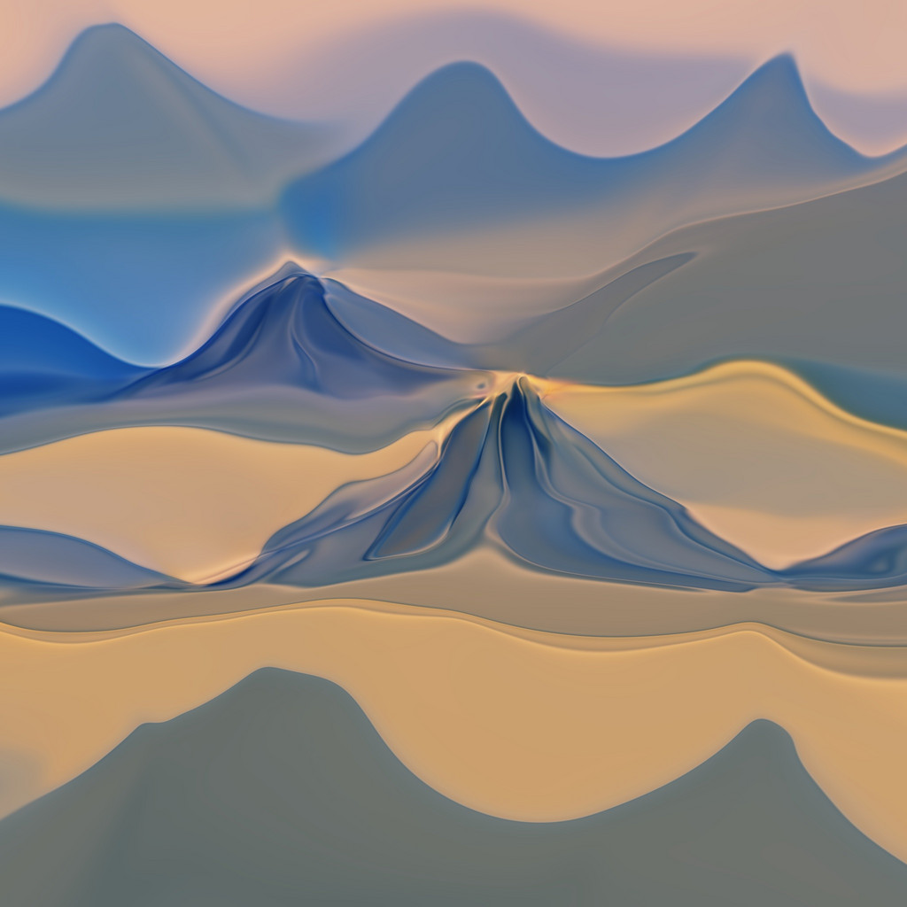

Differentiable image parameterizations invite us to ask “what kind of image
generation process can we backpropagate through?” The answer is quite a lot,
and some of the more exotic possibilities can create a wide range of
interesting effects, including 3D neural art, images with transparency, and
aligned interpolation

## Other images from the series

<video loop autoplay src='mixed4b_pool_reduce_pre_relu_27.mp4' ></video>
<video loop autoplay src='mixed4d_3x3_bottleneck_pre_relu_139.mp4' ></video>

*Mountains* is a collaboration between Jana Sam & Alex Mordvintsev

<video loop autoplay src='starry2.mp4' ></video>
