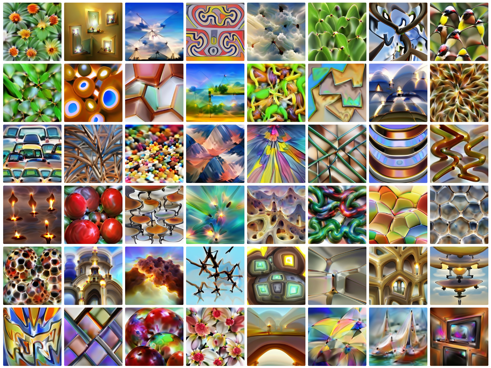
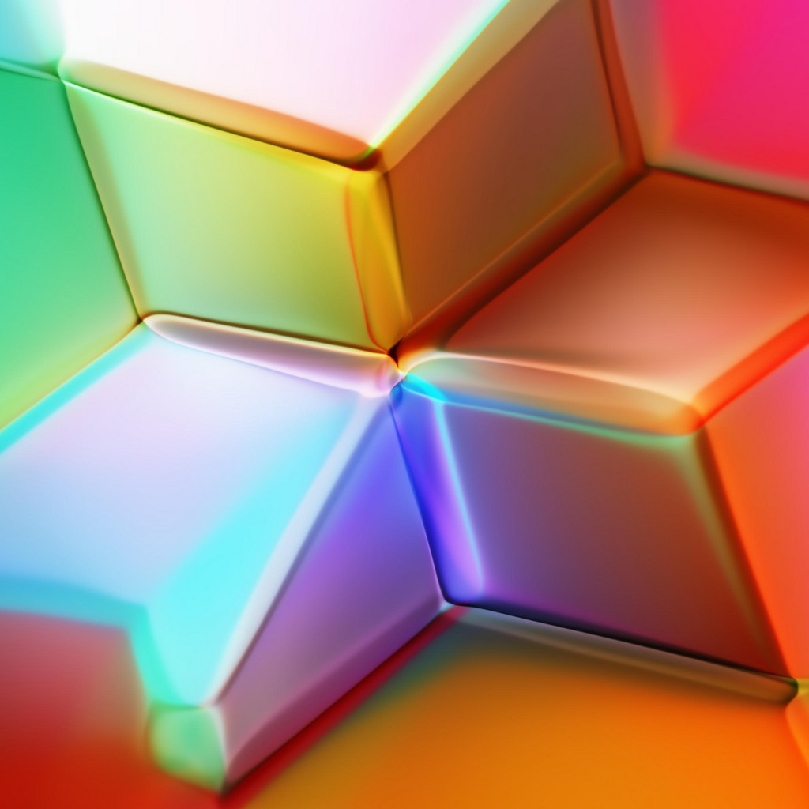
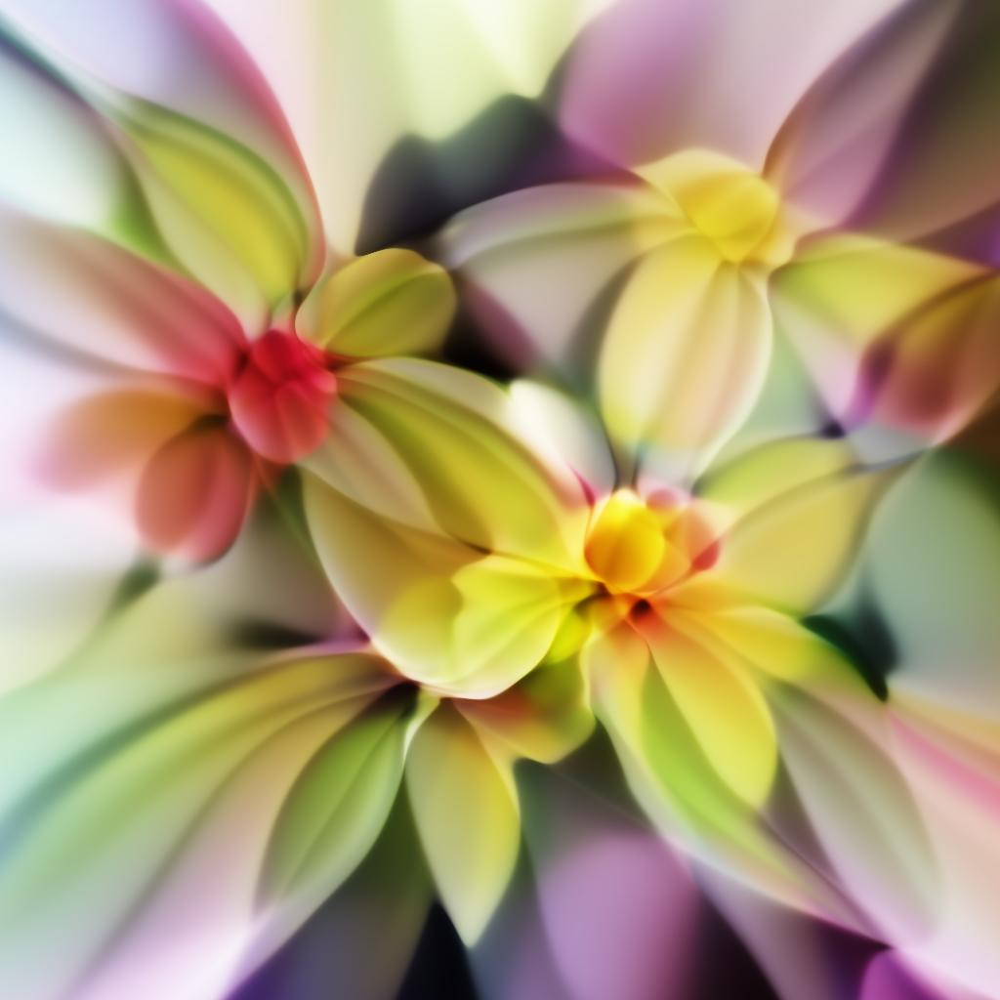

Differentiable image parameterizations invite us to ask “what kind of image
generation process can we backpropagate through?” The answer is quite a lot,
and some of the more exotic possibilities can create a wide range of
interesting effects, including 3D neural art, images with transparency, and
aligned interpolation

