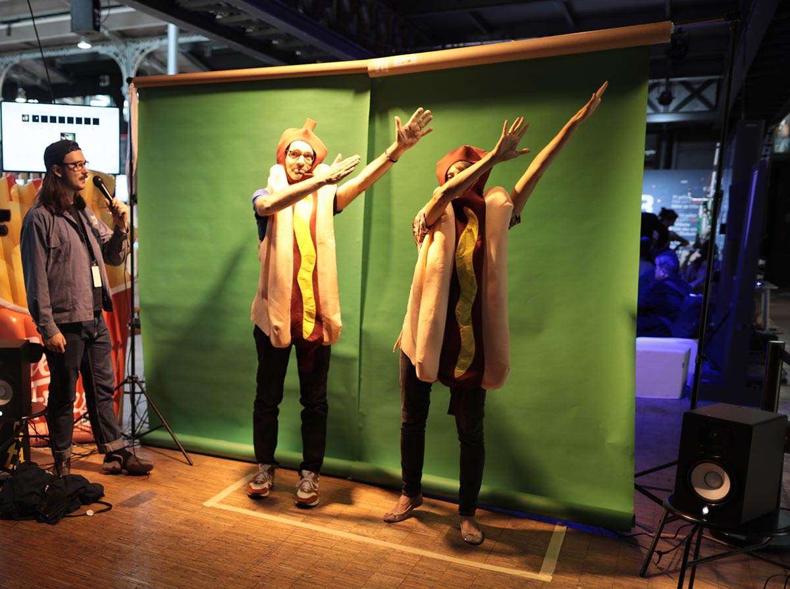
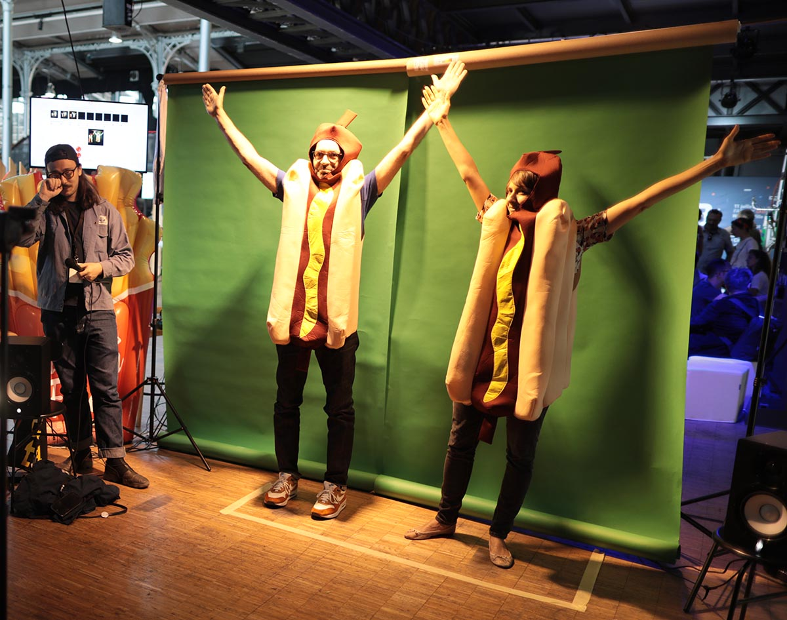
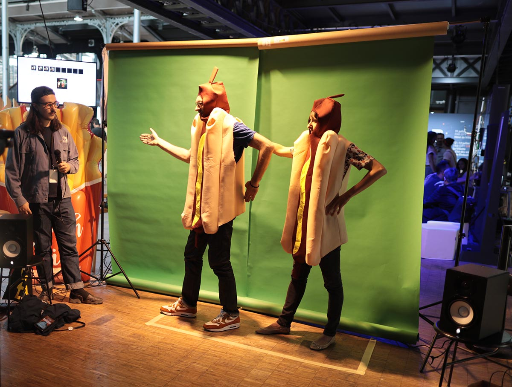
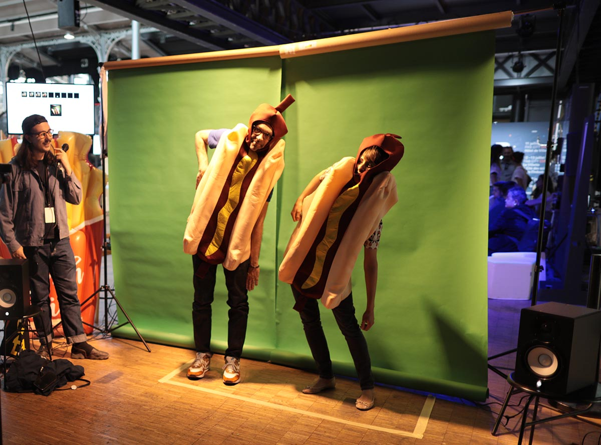

Data.Bingo, the company that loves chance, offers a unique and founding
experience in a life course. Confront yourself to a choreography punctuated by
Data and I.A where you will define by yourself a new way to move like a
sausage.

The best choreographies are celebrated by a madness "Show-Cisse" where many
prizes will be decided by Robert, the unpredictable artificial intelligence of
Data.Bingo.

We have used Tensorflow.js from Google to create the whole performance. A
camera captures the scene. People (one, two, three or more) can choose his own
gesture to play music sample. When the choregraphy is fully created,  the
gestures allow the song to be played. 

It's a real funny DataDada performance to explain to the public what a neural
network is. 

People easily understand the training process and then the playing part. 

 #HotDog #NotHotDog #DataDada

data.bingo/en/

# Who we are

We are a collective of Dada French Artists, and to be even more precise : a
group of DataDada French Artists. 
In our collective, there are artists, developer and data.dingo people :
albertine meunier, julien levesque, sylvie tissot, thu trinh bouvier and
bastien didier. 

You can google us ! We are really famous in France! We are using technology to
do art, dada art, datadada art !!! 

http://data-dada.net/en



