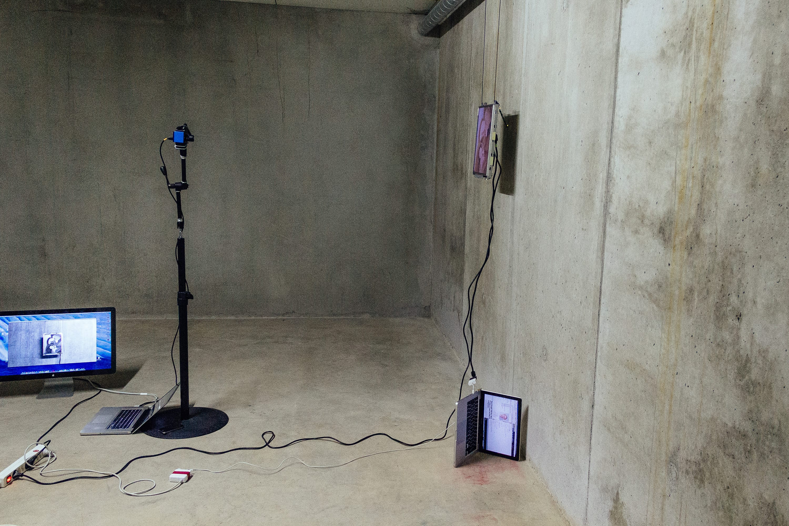
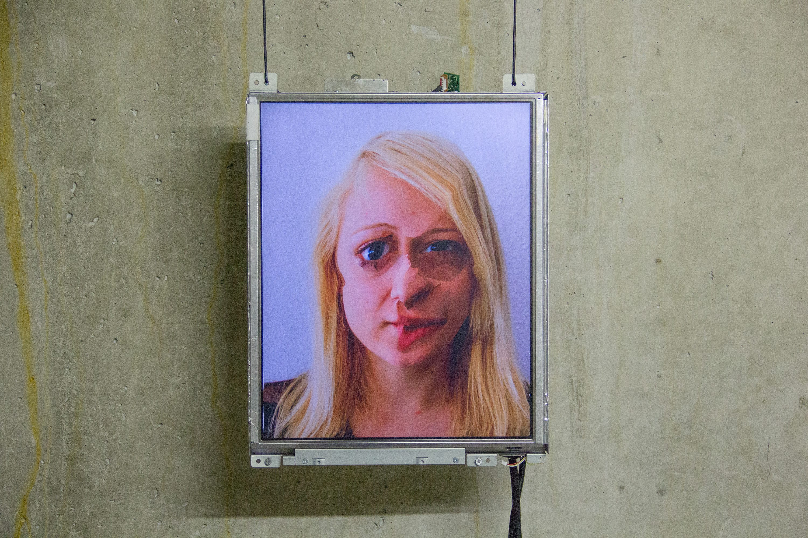
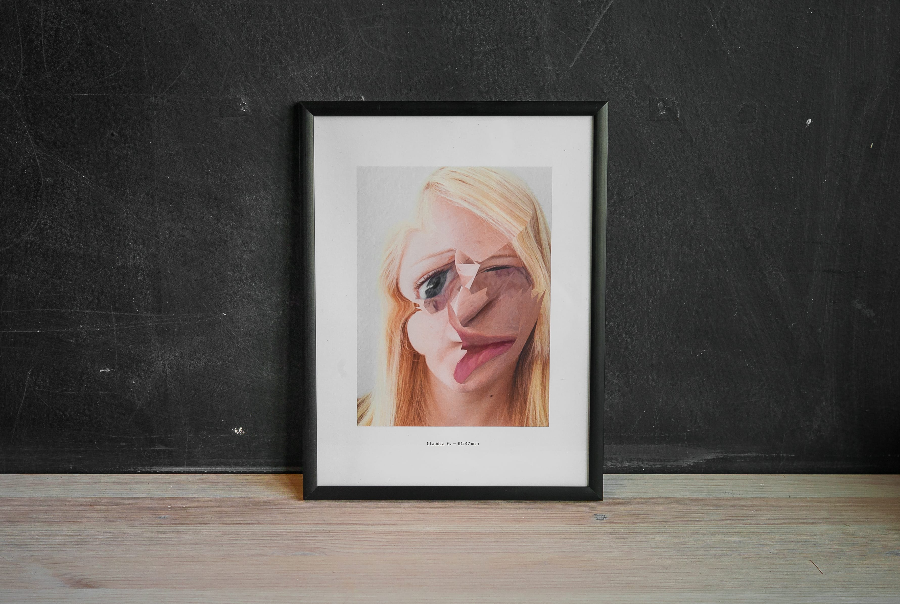
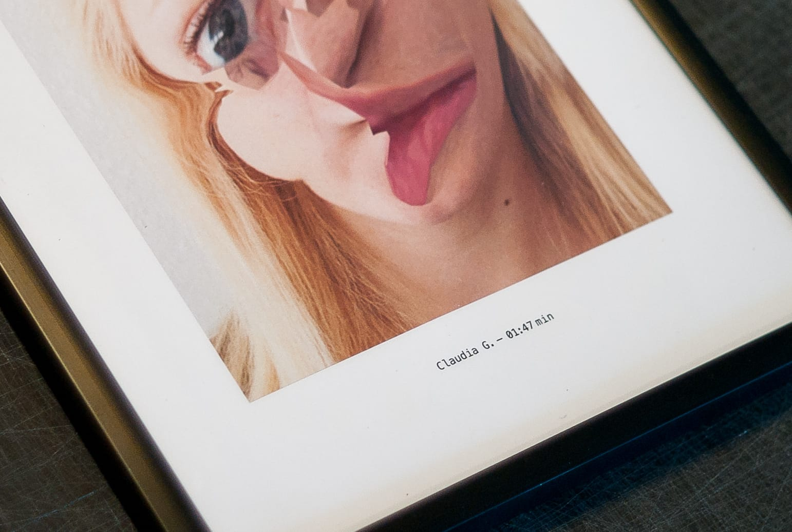

Computer vision relies on algorithms to make sense of the world.
Unseen Portraits explores what face recognition algorithms
consider to be a human face. How much do you have to deform
someone’s features to make them invisible to a machine?


