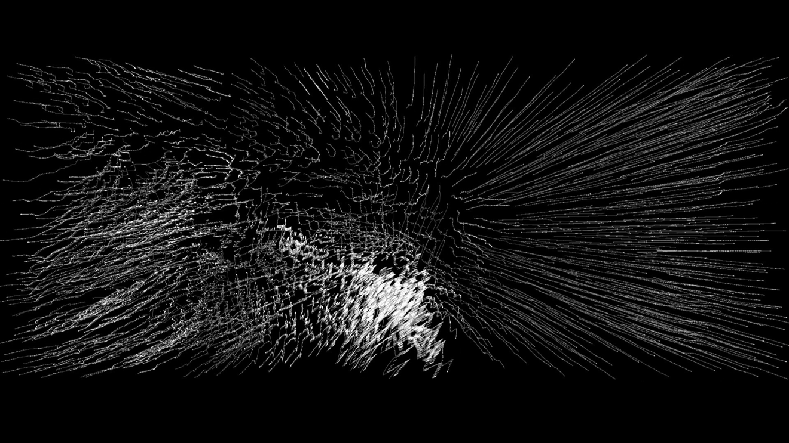
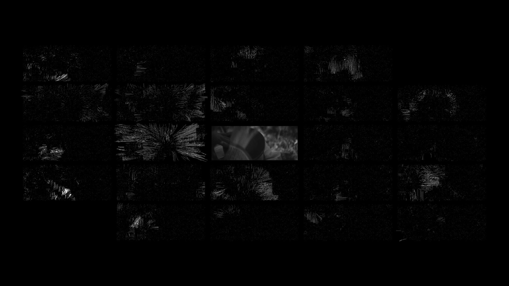
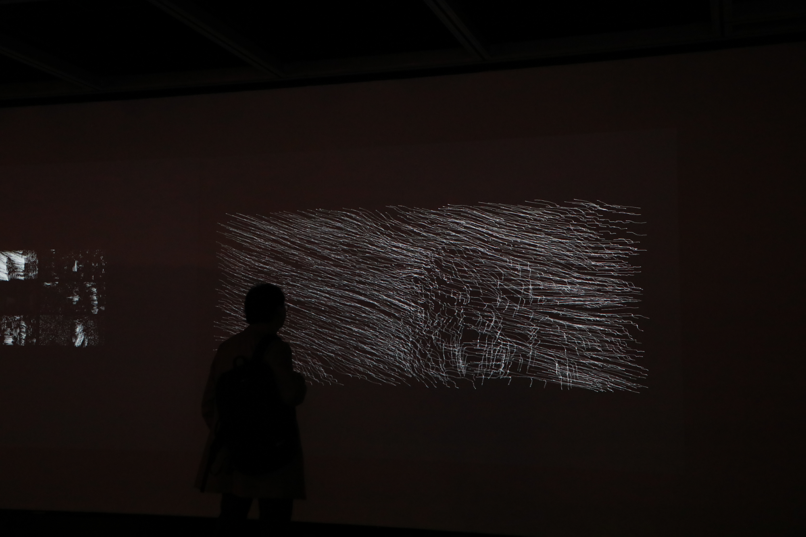
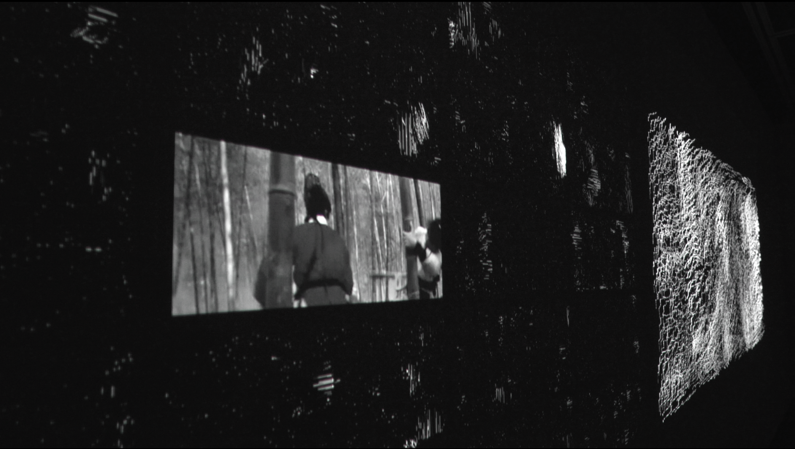

_Errant: The Kinetic Propensity of Images_ is a project about the automatic
analysis and visualization of motion in the cinema. It consists of a two-channel
video projection. The left channel shows the decomposition of the optical flow
of a shot into basic motion patterns. These motions are extracted using
unsupervised machine learning methods. It is possible to reconstruct
approximately the original shot's optical flow by combining those latent
motions. The right channel shows the reconstruction of the optical flow. The
visualization of the optical flow in both channels uses a technique from fluid
dynamics known as streaklines.

Most film analysis and criticism describe movement in cinema by reference to the object that moves. Descriptions of scene motion typically focus on the nature of the moving object (whether it is a person, a car, etc.), its velocity, and perhaps certain aspects of its rhythm. Descriptions of global motion mainly focus on the camera as the source of that motion. Writers characterize camera movement as, for instance, a “pan”, “tilt”, “track”, “dolly”, “zoom”, etc. These terms presuppose a privileged object, the camera, as the source of the visible movement. The conventional vocabulary of critical analysis guides the expectations of the critic or theoretician, who sees only what they expect to find, and they expect to find only that for which they have acquired words. Writers on cinema almost invariably presuppose a mobile camera viewing mobile objects in a three-dimensional world. In other words, the focus is on the causes or sources of the movement rather than on its visible quality. Under these conditions, we lack the resources to describe or represent the phenomenological quality of motion in the cinema.

Our awareness of movement in mainstream films, advertisements and so on is typically bound to specific objects and locations in support of story content. Viewers do not typically attend to the visual qualities of movement itself. Our attention is directed to what is moving, not how it moves. In opposition to this dominant approach, this project aims to focus deep perception on motion. Its aim is, moreover, not purely formal. It embodies a reaction against the denigration of close attention that accompanies the “attention economy,” the commodification of attention in which we are currently immersed, and provides a medium for cultivating and enriching the content and manner of sense perception. In other words, the algorithm developed in this project makes movement perceptually salient as an end in itself.

A shot or sequence in a film often contains several on-screen motions, for instance the movements of different people, as well as the effects of the camera motion. The organization of movement is a crucial aspect of cinematic art. Whenever we focus our attention on the narrative information, we fail to notice the organization of movement in those films. In opposition to this dominant emphasis on the communication of narrative information, this project aims to focus deep perception on motion.

The philosophical and conceptual aspects of this work are mediated by an awareness of computational technology. In particular, the methodology employed here relies on unsupervised machine learning to produce a visual dictionary of motion patterns.

The latent components need not correspond to the conventional categories of cinematic criticism and analysis. The algorithm is not “trained” by exposure to already known examples or “model answers” that embed familiar ways of understanding motion. Rather, the algorithm extracts those latent motions for each shot in the movie in an unsupervised way by applying optimization techniques.

We can think of the use of machine learning in this work as a way to help viewers "unlearn" stereotypical ways of seeing and understanding movies, and sensitizing them to certain qualitative aspects of motion in the cinema.


