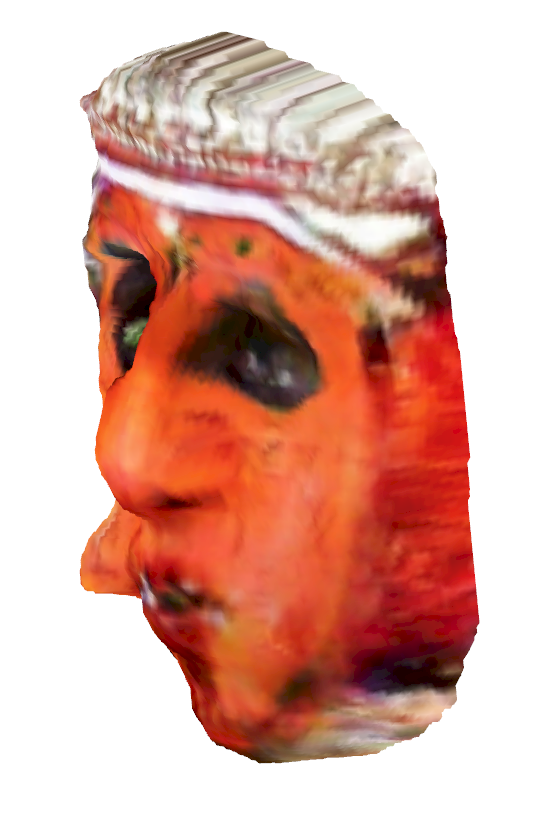
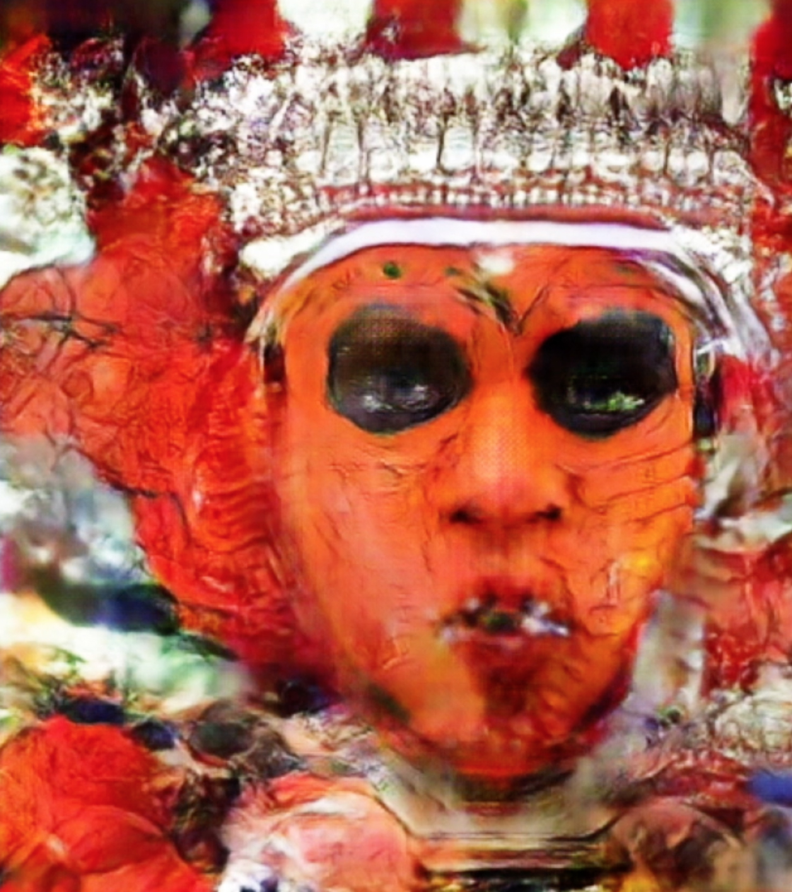

In this series, I create Artificial Intelligence/ Machine Learning generated
faces drawing inspiration from traditional mask cultures of southern regions of
India. Faces of the audience are converted to these faces in real-time using
face tracking and image to image translation computer vision technology. These
faces are then converted to 3D masks, again using face tracking technology,
through the work done by Jackson et al [1], thereby giving the audience a unique
3D model which they can 3D print.




Throughout our years of existence as a culture, we’ve crafted and performed
several kinds of rituals and ceremonies, both collective and individualistic as
acts of transformation and transcendence. Masks and face transformative
decorations have been fundamental across cultures in our journeys into unknown
realms, in our celebrations of the malleability of human representation, or as a
tool for practical disguise and entertainment. It helps us engage with our world
from a completely new vantage point, augmenting our sense of self, very similar
to what technology, especially AI enables today. What happens when these media
of transcendence collide? Can we teach machines about our cultural heritage, and
as a result make them an instrument for our own exploration and engagement with
our heritage.

[1] https://cvl-demos.cs.nott.ac.uk/vrn/
