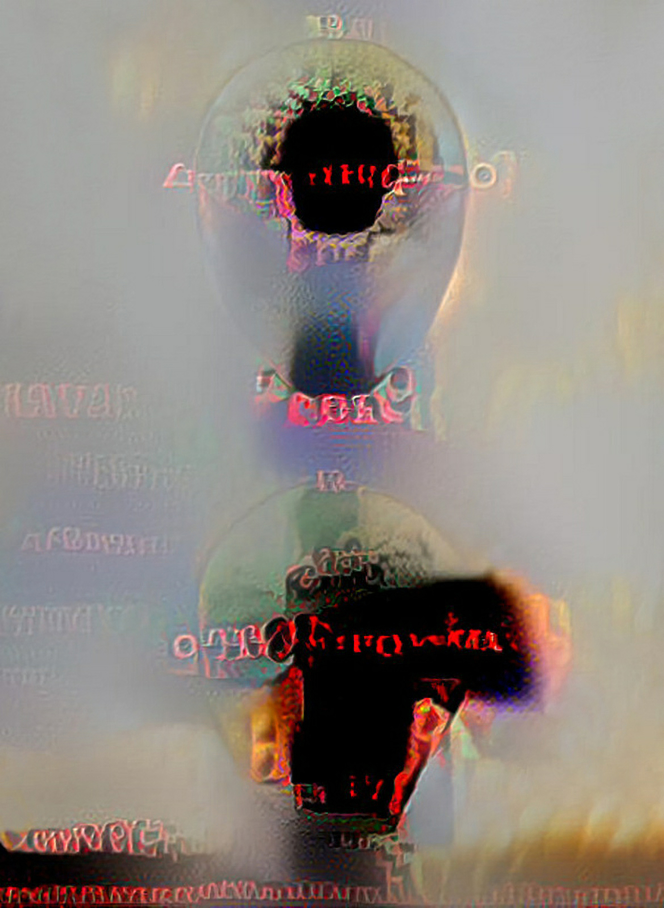

Currently, I am doing a lot of GAN-driven stuff, such as semantic segmentation maps, but the really private thing for me is neural style transfer (NST). Of this, I am
strongly invested in AI-generated asemic art, among other things.
I often combine NST with various non-AI generative/found art approaches, such as fractal art or photographic distortion.
The Noncompliance in the Inferno was produced by sequential transfer of two custom-built styles onto a stock photo image.

